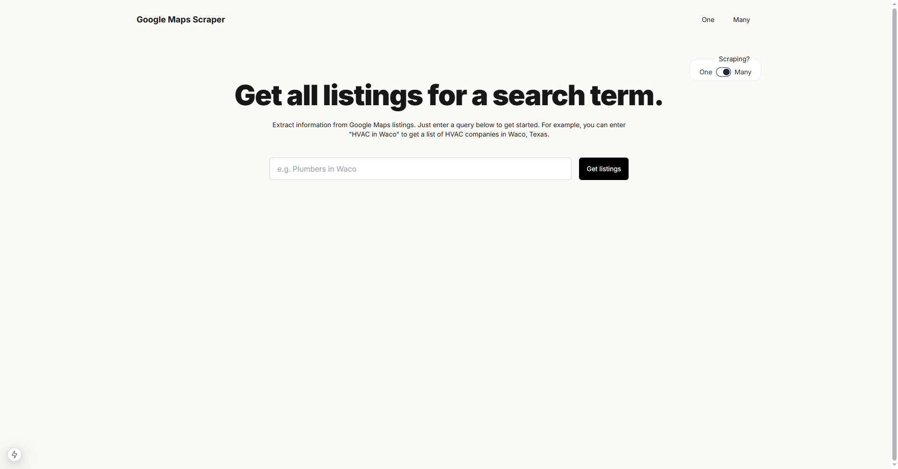
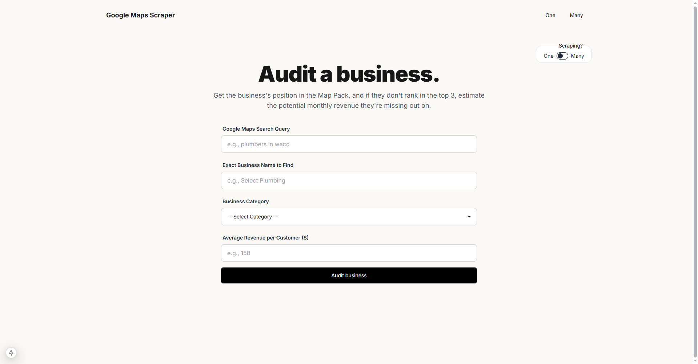

# Google Maps Scraper




## Overview

This Google Maps Scraper is built with Next.js and let's users extract business listing data from Google Maps in **two distinct modes**:

### 1. Bulk Listings Scraper

- Enter a business category and location (e.g., "Plumbers in Waco")
- Scrapes all Google Maps listings for that query
- Extracts:
  - Business name
  - Service category
  - Phone number
  - Website URL
  - Rating & review count
  - Address
  - Google Business Profile (GBP) link
- Results can be copied directly to Google Sheets

### 2. Audit & Position Scraper

- Enter a search query, target business name, category, and average dollar amount
- Finds the position of the target business in the Google Maps results
- Calculates potential monthly revenue missed if not in the top 3
- Returns:
  - Position of the business in results
  - Total listings scraped
  - Potential monthly revenue missed
  - Calculation details
  - Top 5 listings found

Both modes use Puppeteer for browser automation and Cheerio for HTML parsing, with auto-scroll logic to load more results.

## Features

- Two scraping modes: Bulk Listings and Audit/Position
- Scrape Google Maps for business listings by category and location
- Find a business's position in the Map Pack and estimate missed revenue
- Autocomplete for valid business categories
- Auto-scroll to load more results
- Copy results to Google Sheets (tab-separated)
- Modern UI with Tailwind CSS

## Installation

1. Clone the repository:
   ```bash
   git clone <repository-url>
   ```
2. Navigate to the project directory:
   ```bash
   cd google-maps-scraper
   ```
3. Install dependencies:
   ```bash
   npm install
   ```

## Usage

1. Start the development server:
   ```bash
   npm run dev
   ```
2. Open [http://localhost:3000](http://localhost:3000) in your browser.
3. Choose your mode:
   - **Bulk Listings:** Enter a business category and location, then click "Get listings" to scrape all results.
   - **Audit & Position:** Enter a search query, target business name, category, and average dollar amount, then click "Audit business" to find its position and estimate missed revenue.
4. Copy results to Google Sheets as needed.

## Notes

- Some listings with "Call now" or "Order online" may not include phone/website info.
- Scraping Google Maps may be subject to rate limits or changes in Google’s markup.
- Revenue calculations use category-specific conversion rates and search volume data.

## License

MIT
