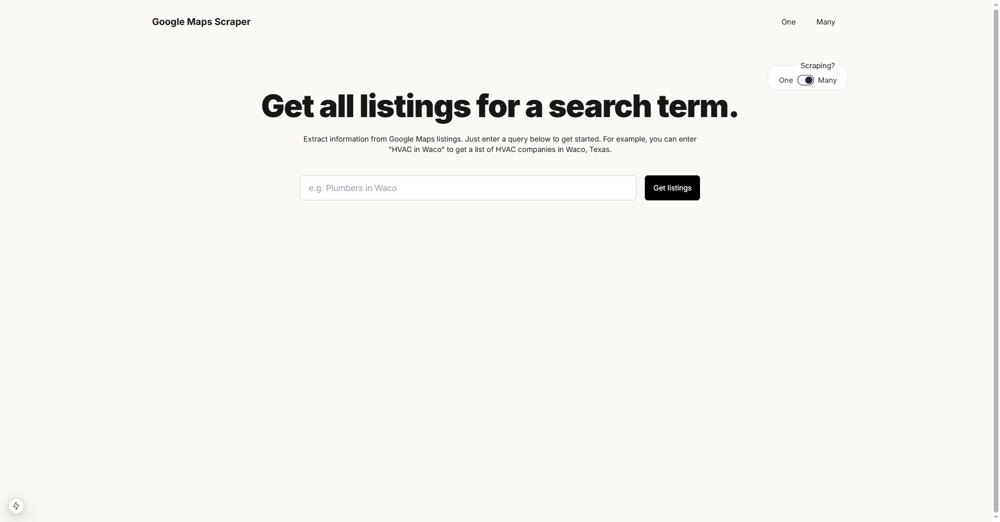

# Google Maps Scraper

<div style="display: flex; gap: 16px;">
    
</div>

## Overview

This Google Maps Scraper is built with Next.js and allows users to extract business listing data from Google Maps at scale.

### Bulk Listings Scraper

- Enter a business category and location (e.g., "Plumbers in Waco")
- Scrapes Google Maps listings for that query with auto-scroll logic
- Extracts:
  - Business name
  - Service category
  - Phone number
  - Website URL
  - Rating
  - Google Business Profile (GBP) link
- Results can be copied directly to Google Sheets

Both the frontend and backend utilize Puppeteer for browser automation and Cheerio for robust HTML parsing of the latest Google Maps layout.

## Features

- Scrape Google Maps for business listings by category and location
- Advanced selector logic for high-accuracy data extraction
- Autocomplete for valid business categories
- Auto-scroll to load all available results
- Copy results to Google Sheets (tab-separated)
- Modern UI with Tailwind CSS and Shadcn UI

## Installation

1. Clone the repository:
   ```bash
   git clone <repository-url>
   ```
2. Navigate to the project directory:
   ```bash
   cd google-maps-scraper
   ```
3. Install dependencies:
   ```bash
   npm install
   ```

## Usage

1. Start the development server:
   ```bash
   npm run dev
   ```
2. Open [http://localhost:3000](http://localhost:3000) in your browser.
3. Enter a business category and location, then click "Get listings" to scrape results.
4. Copy results to Google Sheets as needed.

## Notes

- Some listings with "Call now" or "Order online" may not include phone/website info.
- Scraping Google Maps may be subject to rate limits or changes in Google’s markup.
- The scraper skips ads and invalid listings to ensure high-quality data.

## License

MIT
